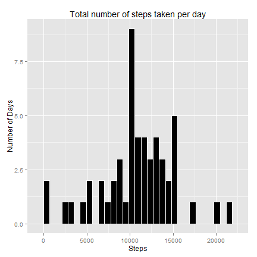
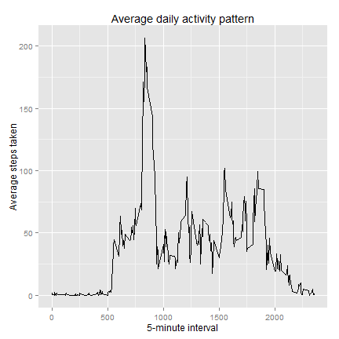
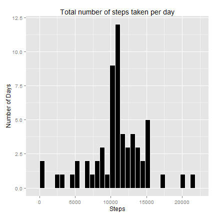
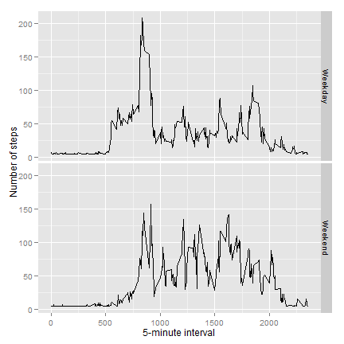

# Reproducible Research: Peer Assessment 1
### Set options

```r
opts_chunk$set(message = FALSE, fig.width = 6, fig.height = 6)
```
### Load required libraries

```r
library(ggplot2)
library(plyr)
```

## Loading and preprocessing the data

```r
unzip("activity.zip")
activity = data.frame(read.table("activity.csv", header = TRUE, sep = ",")) 
```

## What is the mean total number of steps taken per day?
### Histogram of the total number of steps taken per day

```r
stepsByDay = aggregate(steps ~ date, data = activity, FUN = sum, na.rm = TRUE)
p = ggplot(stepsByDay, aes(steps)) + 
    geom_histogram(fill = "black", color = "white") +
    ggtitle("Total number of steps taken per day") +
    xlab("Steps") +
    ylab("Number of Days")
print(p)
```

 
### The mean and median total number of steps taken per day

```r
mean(stepsByDay$steps, na.rm = TRUE)
```

```
## [1] 10766
```

```r
median(stepsByDay$steps, na.rm = TRUE)
```

```
## [1] 10765
```
 
## What is the average daily activity pattern?

```r
avgStepsPerInterval = aggregate(steps ~ interval, data = activity, FUN = mean, na.rm = TRUE)
p = ggplot(avgStepsPerInterval, aes(interval, steps)) +
    geom_line() + 
    ggtitle("Average daily activity pattern") +    
    xlab("5-minute interval") + 
    ylab("Average steps taken")
print(p)
```

 

### Which 5-minute interval, on average across all the days in the dataset, 
### contains the maximum number of steps?

```r
avgStepsPerInterval$interval[which.max(avgStepsPerInterval$steps)]
```

```
## [1] 835
```

## Imputing missing values
### Calculate total number of missing values in the dataset (i.e. the total number of rows with NAs)

```r
nrow(activity) - sum(complete.cases(activity))
```

```
## [1] 2304
```

### Create a new dataset that is equal to the original dataset but with the missing data filled in
#### Missing steps are replaced here with the mean number of steps per interval

```r
missingData = activity
meanInterval = mean(unlist(avgStepsPerInterval[2]))
missingData$steps[sapply(missingData$steps, is.na)==TRUE] <- meanInterval
missingDataByDay = aggregate(steps ~ date, data = missingData, FUN = sum, na.rm = TRUE)
p = ggplot(missingDataByDay, aes(steps)) + 
    geom_histogram(fill = "black", color = "white") +
    ggtitle("Total number of steps taken per day") +
    xlab("Steps") +
    ylab("Number of Days")
print(p)
```

 

#### The mean and median total number of steps taken per day with imputed data

```r
mean(missingDataByDay$steps)
```

```
## [1] 10766
```

```r
median(missingDataByDay$steps)
```

```
## [1] 10766
```

Using the mean steps per interval to replace the missing data changed the median from 10765 to 10766. The mean and the median of the imputed data is same.


## Are there differences in activity patterns between weekdays and weekends?

```r
missingData$DayType = ifelse(weekdays(as.Date(missingData$date)) %in% 
                                   c("Saturday", "Sunday"), "Weekend", "Weekday")

averageByDayType = aggregate(steps ~ interval + DayType, data = missingData, mean)
p = ggplot(averageByDayType, aes(interval, steps)) + 
    geom_line() + 
    facet_grid(DayType ~ .) + 
    xlab("5-minute interval") + 
    ylab("Number of steps")
print(p)
```

 
